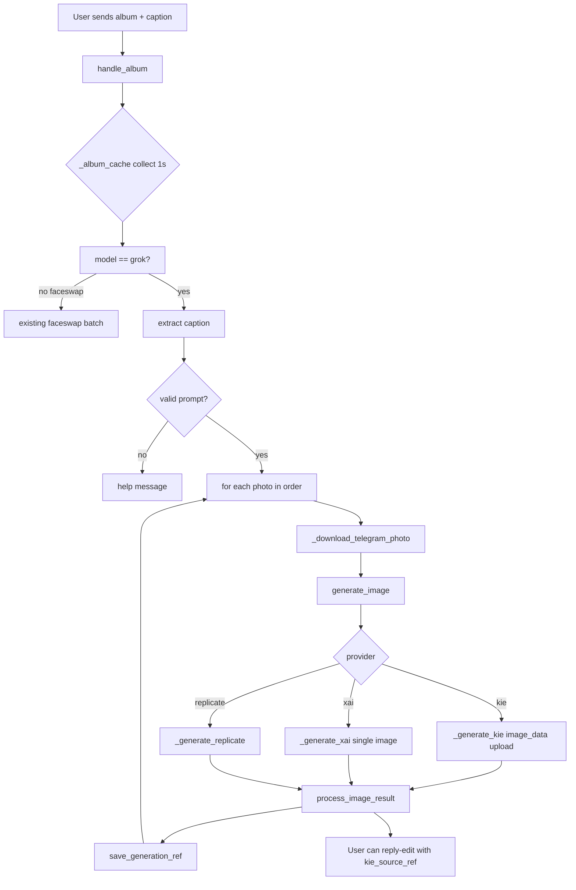

# Impact Analysis: Album Batch Image Editing (Grok Imagine)

**Feature ID:** `album-batch-kie-imagine`  
**Date:** 2026-06-23  
**Scope:** Sequential batch i2i editing when user sends a Telegram media group (album) with photos + caption, while **Grok Imagine** (`model == "grok"`) is active. Primary provider: **Kie.ai**; must remain compatible with **xAI** and **Replicate** Grok Imagine backends and existing **kie_source_ref** reply-chain flow.

---

## 1. Executive Summary

Today, `handle_album` silently ignores albums unless `model == "faceswap"`. Album photos with a caption on the first item are incorrectly routed to `handle_photo_caption` (registered earlier), so only the **first** image is edited and the rest are dropped. The feature should extend the existing album collection pattern to Grok Imagine: collect all album messages, extract caption from any message, then **sequentially** call `generate_image` → `process_image_result` per image with the same prompt.

No changes to `_generate_kie`, `_generate_xai`, or `kie_source_ref` internals are required — batch inputs always use fresh Telegram uploads (`image_data`), not task refs. The main work is handler routing, a regression fix on `handle_photo_caption`, sequential orchestration, status UX, and tests. `sessions.py` persistence is unchanged unless optional in-memory batch-guard state is added.

---

## 2. Current State (Verified)

### 2.1 Handler routing (`bot.py`)

| Handler | Filter | Grok album behavior today |
|---------|--------|---------------------------|
| `handle_photo_caption` (L1001) | `photo and caption` | **Wins first** for captioned album item → single-image edit |
| `handle_photo_no_caption` (L1065) | `photo and not caption and not media_group_id` | Skips album items |
| `handle_reply_edit` (L1092) | `text and reply_to_message.photo` | Unrelated to albums |
| `handle_album` (L1184) | `photo and media_group_id` | `return` if `model != "faceswap"` |

**Aiogram behavior:** handlers are evaluated in registration order; first match wins (no `SkipHandler` in codebase). Album + caption is a **pre-existing routing bug** for Grok.

### 2.2 Album infrastructure (faceswap only)

```1179:1211:bot.py
_album_cache: dict[tuple, list] = {}
_album_lock = asyncio.Lock()
ALBUM_COLLECT_DELAY = 1.0

@dp.message(lambda m: m.photo and m.media_group_id)
async def handle_album(message: types.Message):
    ...
    if state["model"] != "faceswap":
        return  # silently ignore albums for image generation models
```

- Cache key: `(chat_id, media_group_id)`
- Delay: 1.0s then process all collected messages
- Faceswap: parallel batch via Replicate `_process_batch_replicate_sync`, replies with `reply_media_group`

### 2.3 Single-image edit path (reference implementation)

`handle_photo_caption` (L1001–1059) for `grok`:

1. `_validate_prompt(caption)`
2. `_download_telegram_photo(message.photo[-1])`
3. `generate_image(model, prompt, image_data)`
4. `process_image_result(...)` with `regen_context` including `source_file_id`

`handle_reply_edit` (L1093–1173) for Kie:

- Tries `_resolve_reply_kie_ref` → `kie_source_ref` (no re-upload)
- Falls back to `_download_telegram_photo` on reply target
- Same `generate_image` / `process_image_result` chain

### 2.4 Generation stack

| Function | Role | Batch relevance |
|----------|------|-----------------|
| `generate_image` (L1399) | Routes by `model.provider` → xai / kie / replicate | Callable per image; no batch API |
| `_generate_kie` (L1739) | Upload OR `kie_source_ref` → `KIE_IMAGE_I2I` → poll | One image per task; returns `kie_meta` |
| `_generate_xai` (L1442) | Single `image` in `/images/edits` body | One image per call |
| `process_image_result` (L1798) | Download result, `answer_photo`, `save_generation_ref` | Per-image send + regen keyboard |
| `_resolve_reply_kie_ref` (L405) | `generation_refs.json` lookup by `chat_id:message_id` | **Input path only** for reply edits |

### 2.5 Kie `kie_source_ref` (“two images” / reply chain)

- Stored via `sessions.save_generation_ref` on each bot-sent image (`kie_task_id`, `kie_index`)
- Used when user **replies with text** to a prior bot Kie image
- `_generate_kie` resolves ref URL via `_kie_get_result_url_at_index` then creates new i2i task
- **Album batch does not use this for inputs** — sources are user-uploaded Telegram photos

### 2.6 Sessions (`sessions.py`)

- No album/batch fields in `_default_session_record`
- `user_state` in-memory: `pending_prompt` exists but unused for albums
- `generation_refs.json`: written per output image; each batch output gets independent ref for future reply edits

### 2.7 Tests

- `tests/test_kie_provider.py`: Kie i2i upload, `kie_source_ref`, reply-edit video ref, `process_image_result` ref save — **no album tests**
- `tests/test_video_handlers.py`: `handle_photo_caption` / `handle_reply_edit` for `grok_video` only
- No `handle_album` tests anywhere

---

## 3. Proposed Behavior

| Step | Action |
|------|--------|
| 1 | User in `model == "grok"` sends album (≤10 photos) with caption on one item (typically first) |
| 2 | Bot collects all items via existing `_album_cache` + `ALBUM_COLLECT_DELAY` |
| 3 | Extract prompt from first non-empty `caption` across collected messages |
| 4 | Validate prompt (`_validate_prompt`); if missing → help message (mirror `handle_photo_no_caption`) |
| 5 | Reply status: e.g. `Editando 3/5 imágenes con Grok Imagine (Kie.ai • …)...` |
| 6 | **For each image (stable order by `message_id`):** download → `generate_image` → on success `process_image_result`; on error stop or continue (recommend: stop on first error, report which index failed) |
| 7 | Final status update: `Completadas 5/5` or partial failure summary |

**Out of scope (unless explicitly expanded):**

- `grok_video` album → sequential i2v (different handler path, much longer polls)
- `seedream` album batch
- Parallel Kie tasks (rate limits, cost, status complexity)
- Reply-as-batch-source using `kie_source_ref` for album inputs
- Sending results as a single `reply_media_group` (spec says send each result as it completes)

---

## 4. Compatibility Assessment

### 4.1 vs `kie_source_ref` reply chain

| Aspect | Conflict? | Notes |
|--------|-----------|-------|
| Batch **inputs** | **No** | Always `image_data` from Telegram `file_id` |
| Batch **outputs** | **No** | Each `process_image_result` saves its own `kie_task_id`; user can reply-edit any output individually afterward |
| Regen button on outputs | **No** | `regen_context` per image with `source_file_id` (Telegram), not `kie_source_ref` |
| Index semantics | **Low risk** | Batch outputs always `kie_meta.index = 0` (single URL per task); distinct from multi-URL tasks |

**Conclusion:** Orthogonal flows. Reply chain activates **after** batch completes, on individual bot messages.

### 4.2 vs xAI single-image edit

| Aspect | Conflict? | Notes |
|--------|-----------|-------|
| API shape | **No** | Sequential `_generate_xai(..., image_data)` calls |
| Size limit | **No** | `_validate_image_for_i2v` per image (5 MB) |
| Polling | **N/A** | xAI is synchronous HTTP; batch is naturally sequential |
| Download allowlist | **No** | Existing `_download_allowlist_for_provider("xai")` |

### 4.3 vs Replicate Grok Imagine

| Aspect | Conflict? | Notes |
|--------|-----------|-------|
| Provider routing | **No** | `generate_image` → `_generate_replicate` with `image` input |
| Concurrency | **Low** | Replicate may rate-limit; sequential is safer |

### 4.4 vs faceswap albums

| Aspect | Conflict? | Notes |
|--------|-----------|-------|
| Shared `_album_cache` | **Medium** | Same `(chat_id, media_group_id)` key — OK if processing is model-dispatched at flush time |
| Handler branch | **No** | Keep `if model == "faceswap"` branch; add `elif model == "grok"` |
| Output pattern | **Different** | Faceswap: one media group at end; Grok: individual photos per iteration |
| AWAITING_SOURCE | **No** | Faceswap-only `fs_state` branch unaffected |

### 4.5 vs `handle_photo_caption` (critical)

| Aspect | Conflict? | Notes |
|--------|-----------|-------|
| Double handling | **Yes — today** | Captioned album item matches `handle_photo_caption` before `handle_album` |
| Fix required | **Yes** | Add `and not m.media_group_id` to `handle_photo_caption` filter |

---

## 5. Architecture Recommendation

### 5.1 Extend `handle_album` (preferred over new handler)

**Rationale:**

- Reuses proven collection pattern (`_album_cache`, `_album_lock`, `ALBUM_COLLECT_DELAY`)
- Single entry point for all `media_group_id` photos
- Faceswap logic stays isolated in its branch

**Structure:**

```
handle_album(message):
  state = get_user_state(...)
  if state["model"] == "faceswap":
    ... existing faceswap paths ...
  elif state["model"] == "grok":
    ... append to _album_cache, schedule _process_grok_album_after_delay ...
  else:
    return  # or optional one-line hint for seedream/grok_video

_process_grok_album_after_delay(cache_key, first_msg):
  ... pop messages, sort by message_id ...
  prompt = next((m.caption.strip() for m in messages if m.caption), "")
  ... validate, status_msg ...
  for i, msg in enumerate(messages, 1):
    update status "Editando i/N..."
    image_data = await _download_telegram_photo(msg.photo[-1])
    output, err, kie_meta = await generate_image(model, prompt, image_data)
    if err: ... break
    await process_image_result(..., message=first_msg, regen_context with source_file_id=...)
  finalize status
```

### 5.2 Extract shared helper (optional, reduces duplication)

`_do_generate_image_edit(message, model, prompt, image_data, *, reply_anchor=message)` wrapping lines 1027–1048 of `handle_photo_caption` — used by single-photo and album loop. **Not mandatory** for v1 but lowers drift risk.

### 5.3 Caption extraction

```python
def _album_prompt(messages: list[types.Message]) -> str | None:
    for msg in sorted(messages, key=lambda m: m.message_id):
        if msg.caption and msg.caption.strip():
            return msg.caption.strip()
    return None
```

Telegram convention: caption on first item only; scanning all messages is defensive.

### 5.4 State management for in-progress batch

| Approach | Recommendation |
|----------|----------------|
| Persist to `sessions.json` | **No** — batch is ephemeral |
| In-memory `user_state["album_batch_active"]` | **Optional** — reject overlapping albums from same user |
| Per-user `asyncio.Lock` | **Optional** — prevent concurrent single edit + album |
| Status message | Edit one `status_msg` for progress; individual results via `process_image_result` (deletes status per image today) |

**UX note:** `process_image_result` calls `status_msg.delete()` after each image. For batch, either:

- Pass a **dedicated batch status message** separate from per-image flow, and **do not** pass it to `process_image_result` (use `message.answer_photo` only), OR
- Add optional `delete_status: bool = True` param to `process_image_result`

Recommend **separate batch `status_msg`** + minor `process_image_result` flag to skip delete when caller manages batch status.

### 5.5 Handler filter fix (required prerequisite)

```python
# Before
@dp.message(lambda m: m.photo and m.caption)

# After
@dp.message(lambda m: m.photo and m.caption and not m.media_group_id)
```

### 5.6 Album collect delay

`ALBUM_COLLECT_DELAY = 1.0` may miss slow-delivered album items (Telegram can spread over several seconds). Consider `1.5–2.0s` for Grok or shared constant bump — **low priority**, same risk exists for faceswap.

---

## 6. Files to Change / Create

| File | Change | Priority |
|------|--------|----------|
| `bot.py` | Extend `handle_album` + `_process_grok_album_after_delay` (or generalized processor); fix `handle_photo_caption` filter; optional `process_image_result(delete_status=)`; update `/start` help text for grok | **Required** |
| `tests/test_album_batch.py` (new) or `tests/test_kie_provider.py` | Album collection, sequential `generate_image` calls, caption extraction, faceswap regression, photo_caption filter regression | **Required** |
| `config_flow.py` | Optional help string: album + caption for batch edit | Low |
| `sessions.py` | No change expected | — |

**Consumers of touched symbols:**

- `generate_image` — all image edit/generate paths (regen, text, caption, reply)
- `process_image_result` — regen flow, generation_refs
- `handle_album` — faceswap only today; faceswap tests needed if none exist

---

## 7. Risks

| ID | Risk | Severity | Mitigation |
|----|------|----------|------------|
| R1 | `handle_photo_caption` steals first album item | **Critical** | Filter `not media_group_id` |
| R2 | Long-running batch blocks user session (N × up to 10 min Kie poll) | **High** | Progress status; optional cancel; document expectation; cap at Telegram max 10 images |
| R3 | Kie API cost / rate limits on N sequential uploads + tasks | **Medium** | Sequential by design; consider max album size enforcement |
| R4 | Partial failure mid-batch leaves inconsistent UX | **Medium** | Clear status: `3/5 completadas; error en imagen 4: …` |
| R5 | `process_image_result` deletes batch status message | **Medium** | Separate status msg or `delete_status=False` |
| R6 | Shared `_album_cache` race if same user sends two albums quickly | **Low** | Keys include `media_group_id`; different groups OK |
| R7 | Album without caption → silent ignore (current) | **Medium** | Reply with existing help text from `handle_photo_no_caption` |
| R8 | Image size validation fails on one item | **Low** | Per-image `_validate_image_for_i2v` inside `_generate_kie` / `_generate_xai` |
| R9 | Faceswap regression | **Medium** | Add/run faceswap album smoke test |
| R10 | Order of images non-deterministic if not sorted | **Low** | Sort by `message_id` before loop |

---

## 8. Tests to Add / Run

### 8.1 Run existing suite (baseline)

```bash
./venv/bin/python -m pytest tests/ -q
```

Focus areas after implementation:

- `tests/test_kie_provider.py` — ensure no regressions in i2i / kie_source_ref
- `tests/test_video_handlers.py` — photo_caption still works for non-album

### 8.2 New tests (recommended `tests/test_album_batch.py`)

| Test | Asserts |
|------|---------|
| `test_handle_photo_caption_ignores_media_group` | Album item with caption does **not** call `generate_image` directly |
| `test_grok_album_collects_messages` | Multiple `handle_album` calls append to cache; after delay, N images processed |
| `test_grok_album_extracts_caption_from_first_message` | Caption only on msg[0] → correct prompt |
| `test_grok_album_requires_caption` | No caption → help/error, no `generate_image` |
| `test_grok_album_sequential_kie_calls` | Mock `generate_image` called N times in order with same prompt, different `image_data` |
| `test_grok_album_kie_uses_upload_not_ref` | `kie_source_ref` never passed for batch inputs |
| `test_grok_album_saves_generation_ref_per_output` | N × `process_image_result` → N refs |
| `test_grok_album_stops_on_error` | Second `generate_image` returns error → loop stops, status reflects partial |
| `test_faceswap_album_unchanged` | `model == faceswap"` still uses `_process_batch_replicate_sync` |
| `test_grok_album_xai_provider` | `provider == "xai"` routes through `generate_image` per image |
| `test_handle_album_ignored_for_seedream` | Silent return or no batch processing |

**Fixtures:** reuse `conftest.py` `no_sleep` (if exists), `sessions_file`, `generation_refs_file`; patch `asyncio.sleep` for album delay; mock `_download_telegram_photo`, `generate_image`, `process_image_result`.

### 8.3 Manual / live smoke (optional)

- Kie provider: 3-photo album + caption → 3 edited images, reply-edit on result #2 works without re-upload
- xAI provider: 2-photo album → 2 edits
- Faceswap album still returns media group

---

## 9. Definition of Done (Planner / Executor)

- [ ] `handle_photo_caption` excludes `media_group_id` (regression fix)
- [ ] `handle_album` processes `model == "grok"` albums with caption
- [ ] Sequential loop: download → `generate_image` → `process_image_result` per image
- [ ] Same prompt applied to all images; caption extracted from album messages
- [ ] Kie path uses `image_data` upload (not `kie_source_ref`) for batch inputs
- [ ] xAI and Replicate Grok Imagine providers work via existing `generate_image` routing
- [ ] Faceswap album behavior unchanged
- [ ] Batch progress/status UX (i/N) without breaking per-image result messages
- [ ] Each output saves `generation_refs` for subsequent reply-edit chain
- [ ] `/start` or help text mentions album + caption for batch edit (grok mode)
- [ ] New unit tests pass; full `pytest tests/ -q` green
- [ ] No changes required to `sessions.py` schema unless batch-guard added

---

## 10. Open Questions for Planner

1. **Error policy:** Stop entire batch on first failure, or skip failed images and continue?
2. **grok_video / seedream:** Explicit ignore vs future album support message?
3. **Status message:** Single evolving status vs per-image “Editando 2/5…” edits?
4. **Concurrent requests:** Block new generations while batch runs, or allow overlap?
5. **ALBUM_COLLECT_DELAY:** Bump to 2.0s for reliability?
6. **Confirmation step:** Text prompts require confirm for grok; should 10-image album batch also confirm (cost awareness)?

---

## 11. Dependency Graph (Mermaid)



---

*Impact analyzer — analysis only, no implementation.*